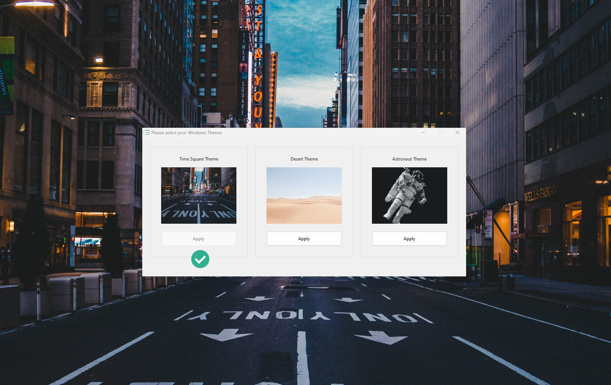

# MyCorporateTheme



<!-- ABOUT THE PROJECT -->
## ℹ️  About The Project
This application helps you to set up easily the corporate theme on the user desktop.
Using commands / and parameters you can also easily force a Windows theme on the user desktop.


<!-- GETTING STARTED -->
## 🚀 Getting Started
MyCorporateTheme uses predefined Windows themes (.theme) from the "Theme" subfolder which are automatically copied to %ProgramData% when selected. Currently max. 3 different themes are supported.<br>
https://blog.tugi.ch/mobile-device-management/create-corporate-windows-theme-and-deploy-over-endpoint-management

### Usage
1. Copy your Windows Themes and the Wallpaper to the sub-folder "Theme"
2. Create a preview file with the same name as the theme (My Company.theme = My Company.jpg)

### Parameters
```
MyCorporateTheme.exe -Theme "My Company.theme"
```
Automatically selects the theme and display the GUI.

```
MyCorporateTheme.exe -Theme "My Company.theme" -AutoClose
```
Automatically selects the theme and does not display a GUI. The application will be closed directly after the selection.


<!-- LICENSE -->
## 📃 License
Distributed under the MIT License. See `LICENSE.txt` for more information.

### Third Party - ThemeSwitcher.exe
ThemeSwitcher by Winaero (Sergey Tkachenkko):
https://winaero.com/winaero-theme-switcher


<!-- CONTACT -->
## 📧 Contact
TUGI - [contact@tugi.ch](mailto:contact@tugi.ch)<br>
